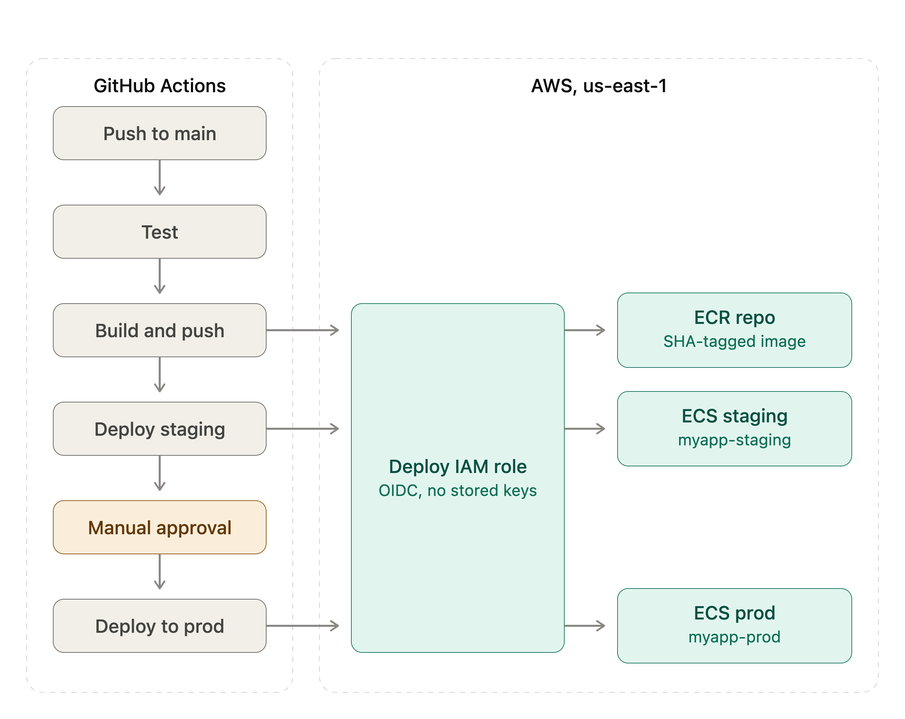

# Docker Project

A small Flask app, containerized and deployed to AWS ECS Fargate through a
gated CI/CD pipeline. The app itself (a personal portfolio page with a
DynamoDB-backed thumbs-up counter) is intentionally simple — the point of
this project was never the app. It was building real, hands-on muscle memory
for the full path a container takes from a laptop to a running, deployed
service: a correctly layered image, a pipeline that won't let untested code
through, a registry, a staged promotion with a real human approval gate
before production — the same shape as a real team's deployment process,
just scaled down to one developer and one small app.

## Architecture



A push to `main` runs four jobs in sequence: `test` → `build-push` →
`deploy-staging` → `deploy-prod`, with a required manual review sitting
between staging and production. Nothing reaches ECR without passing tests,
and nothing reaches production without first running in staging and being
looked at by a person.

## Why this architecture and these services

- **Flask + Gunicorn** — about as little framework as possible standing
  between "a container" and "a container running a web app," so the project
  stayed focused on containerization and deployment mechanics rather than
  application-framework concerns.
- **ECS Fargate, not EC2 or Kubernetes** — the goal was learning
  container orchestration concepts (task definitions, services, desired vs.
  running task count, rolling deploys) without also taking on patching and
  managing EC2 instances or a Kubernetes control plane. Fargate is the
  serverless compute layer for containers.
- **ECR** — the natural registry pairing with ECS and IAM; no extra
  authentication plumbing beyond what the pipeline already needs.
- **DynamoDB for the thumbs-up counter** — a single-item counter doesn't
  need a relational database. DynamoDB's on-demand pricing and zero server
  management fit a toy feature, and it was a chance to practice scoping IAM
  down to exactly `get_item`/`update_item` on one table rather than granting
  broad database access.
- **GitHub Actions with a staged pipeline** — mirrors how a real team ships:
  a test gate, a build gate, a staging environment to actually look at
  before anything reaches production, and a human approval step that can't
  be skipped.

## Why OIDC over long-lived access keys

The pipeline authenticates to AWS via **OpenID Connect federation**
(`aws-actions/configure-aws-credentials` + `role-to-assume`, with
`permissions: id-token: write` at the workflow level) — not a stored
`AWS_ACCESS_KEY_ID` / `AWS_SECRET_ACCESS_KEY` pair in GitHub Secrets.

Static access keys are long-lived credentials: they don't expire on their
own, they can leak through logs, forks, or a compromised dependency, and
they require someone to remember to rotate them. OIDC instead issues a
short-lived, per-run identity token that AWS's IAM role trust policy
verifies against this specific repository before handing back temporary
credentials scoped to that one run. There's no long-lived secret sitting in
GitHub to leak in the first place, and even if a run's token were somehow
captured, it's already expired by the time it could be reused anywhere else.

## What security decisions were made

- **OIDC everywhere in the pipeline** — no static AWS keys stored in GitHub.
- **Least-privilege IAM for the app's own runtime identity** — the
  DynamoDB-facing credentials are scoped to exactly `get_item`/`update_item`
  on one table. This was verified directly, not assumed: that identity
  can't list its own attached IAM policies, can't describe ECR repositories,
  and can't do anything outside its one job.
- **A required manual approval gate before production** — `deploy-prod` uses
  a GitHub `environment: production` protection rule, so a deploy physically
  cannot reach production without a person reviewing the staging deployment
  first.
- **No secrets committed** — `.env`, `venv/`, and local AWS credential files
  are all gitignored; anything sensitive lives in GitHub Secrets.
- **Minimal public surface on the page itself** — only the contact info
  meant to be public (email, LinkedIn, GitHub) appears; no phone number, no
  third-party trackers or CDNs pulled into the page, images served from the
  app's own `static/` folder.
- **Fail-fast AWS calls** — the boto3 client is configured with an explicit,
  short connect/read timeout and a small retry limit, so a flaky or slow
  connection to AWS degrades the page to showing a `0` count instead of
  hanging a web server thread for the duration of a long default timeout.

## What would change for production

This project deliberately stops short of a few things a real production
service would need:

- **A load balancer**, not a raw task IP. Staging currently prints the
  running task's public IP because there's no ALB in front of it — that IP
  changes on every deploy. Production would sit behind an ALB for a stable
  DNS name, TLS termination, and health-check-based traffic draining during
  rolling deploys.
- **A real domain and TLS** (ACM certificate) instead of plain HTTP on an
  ephemeral IP.
- **Private subnets** for the Fargate tasks, reached through the load
  balancer, instead of tasks holding public IPs directly.
- **Autoscaling** instead of a fixed desired count.
- **Centralized logging and alarms** — CloudWatch Logs plus alarms on error
  rate and on running count drifting from desired count, rather than
  reading container logs by hand.
- **Blue/green deploys** (e.g. via CodeDeploy) for instant rollback, instead
  of ECS's default rolling update.
- **Secrets Manager or SSM Parameter Store** for anything sensitive in the
  task definition, instead of plain environment variables.
- **Pinned GitHub Actions**, by commit SHA rather than a floating major
  version tag, to close off a supply-chain risk where a compromised action
  release could run arbitrary code with the pipeline's AWS role.
- **Real test coverage**, not just a health-check smoke test — the
  DynamoDB-backed routes would need tests against a mocked table (e.g. via
  `moto`), not just a check that `/health` returns 200.
- **Container hardening** — a non-root user in the Dockerfile, a base image
  pinned by digest, and image vulnerability scanning as a pipeline gate.

## What failed while building this, and how it was diagnosed

Most of the real learning happened here, not in the parts that worked on
the first try.

1. **Intermittent 10–30 second page hangs.**
   Gunicorn ran a single sync worker with its default 30-second timeout. An
   occasional slow connection to DynamoDB (via Docker Desktop's virtualized
   network) held that one worker long enough to trip gunicorn's own
   watchdog, which killed and rebooted the worker mid-request. Diagnosed by
   timing repeated `curl` requests and correlating the slow ones with
   `[CRITICAL] WORKER TIMEOUT` lines in the container logs. Fixed by giving
   boto3 an explicit short connect/read timeout with limited retries (fail
   in a few seconds instead of hanging near the 30-second ceiling), and by
   adding a second gunicorn worker so one slow request can't block every
   other request on the same process.

2. **`CannotPullContainerError: ... does not contain descriptor matching
   platform 'linux/amd64'` in ECS.**
   The image was built on an Apple Silicon Mac, which defaults to a
   `linux/arm64` image; Fargate defaults to `linux/amd64`. Diagnosed
   directly from the ECS task's stopped-reason message. Fixed with
   `docker build --platform linux/amd64`.

3. **`Input required and not supplied: image` in the ECS task-definition
   render step.** A job output containing the AWS account ID was being
   silently dropped by GitHub Actions
   (`Skip output 'image' since it may contain secret`, visible only in the
   raw job logs via `gh run view --log`), because `configure-aws-credentials`
   masks the account ID as a secret and GitHub won't propagate any output
   that appears to contain one. Fixed by not passing the image URI across
   jobs at all — each job that needs it logs into ECR itself and
   reconstructs the same deterministic URI locally.

4. **Outputs out of scope** `deploy-prod` referenced
   `needs.build-push.outputs.image`, but its own `needs:` list only included
   `deploy-staging` — GitHub Actions only exposes a job's outputs to jobs
   that list it *directly* in `needs:`, not transitively through a chain, so
   that reference could never have resolved to anything.

## What I'd improve next

- Run `scripts/health_check.py` on a schedule (independent of deploys), not
  just as a post-deploy step — right now it only confirms what
  `wait-for-service-stability` already checked seconds earlier. Not doing
  this yet since the environment isn't meant to run continuously, and a
  recurring check would just burn cost polling an app nobody's using.
- Replace the staging "fetch the running task's public IP" step with a real
  load balancer and stable DNS — a reasonable stopgap for a learning
  project, not something to keep long-term.
- Manage the ECS cluster, services, and IAM roles with Terraform instead of
  anything set up by hand in the console, so the infrastructure is
  reproducible and reviewable, not just the application code.
- Expand test coverage beyond the one `/health` smoke test — mock DynamoDB
  (e.g. with `moto`) and actually test the `/like` counter logic and its
  failure-handling paths.
- Pin GitHub Actions to commit SHAs instead of floating major-version tags,
  and add Dependabot to keep both those and the Python dependencies current
  automatically.

## Setup

1. Build the image:
   ```bash
   docker build -t myapp:v1 .
   ```

2. Run it:
   ```bash
   docker run -p 8080:8080 myapp:v1
   ```

3. Access the app at `http://localhost:8080`

## Tests

```bash
pip install -r requirements-dev.txt
pytest
```

## Endpoints

- `GET /` - Portfolio page with a DynamoDB-backed thumbs-up counter
- `POST /like` - Increments the counter, returns the new count as JSON
- `GET /health` - Health check

## Scripts

- `scripts/health_check.py` - Compares the production ECS service's running
  task count against its desired count and exits non-zero on a mismatch, so
  it can plug into a CI health check rather than requiring a human to read
  its output. Reads `ECS_CLUSTER` and `ECS_SERVICE_PROD` from the
  environment (the same names already used as secrets in
  `.github/workflows/deploy.yml`). Runs today as a sanity-check step right
  after `deploy-prod`; it's written to also work as a standalone,
  deploy-independent check (see "What I'd improve next").
