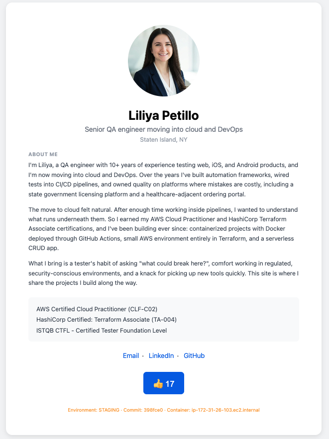
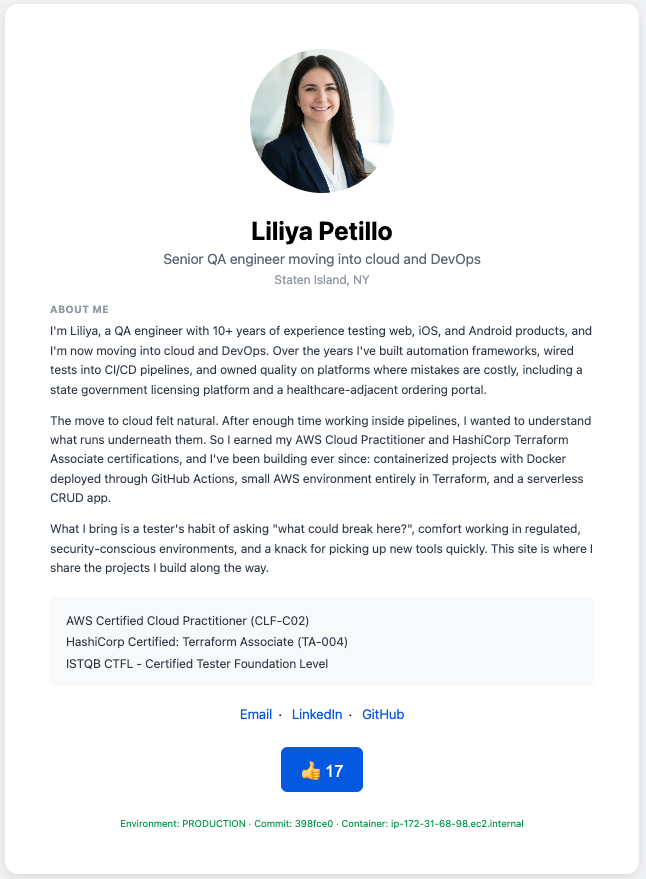
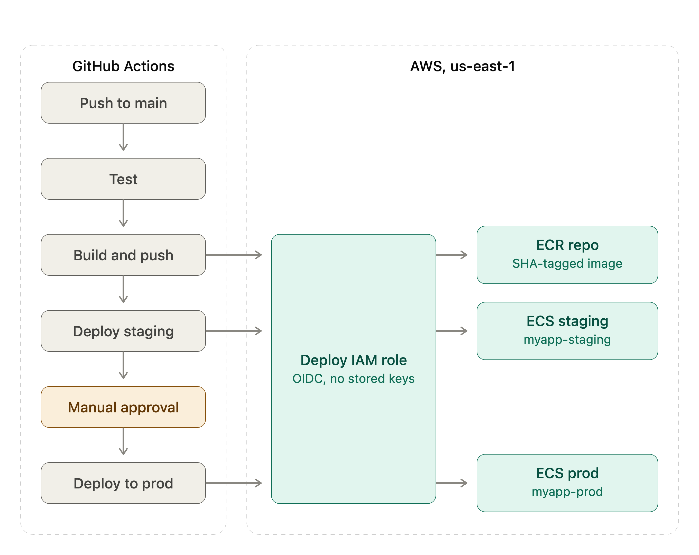
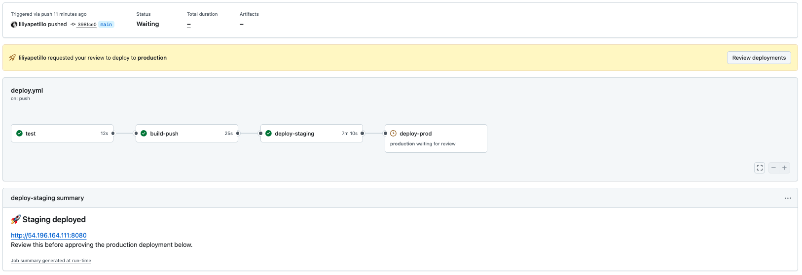
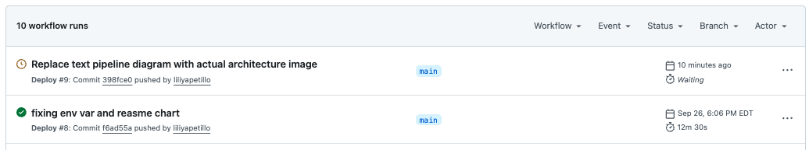
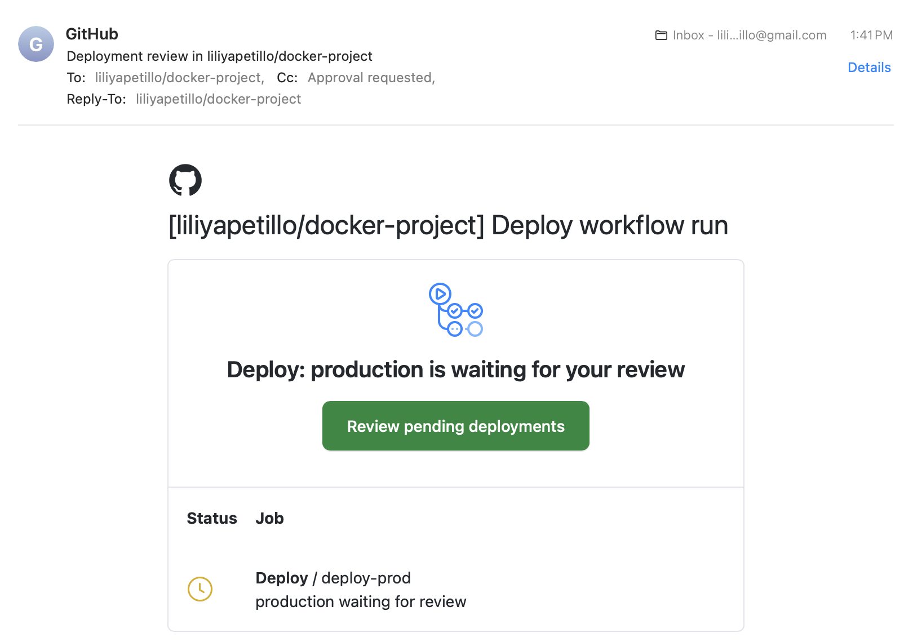
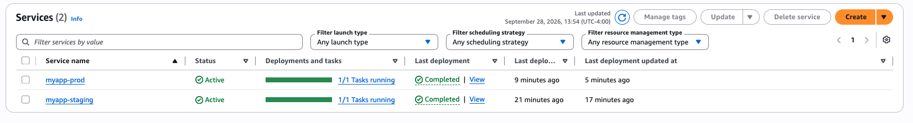
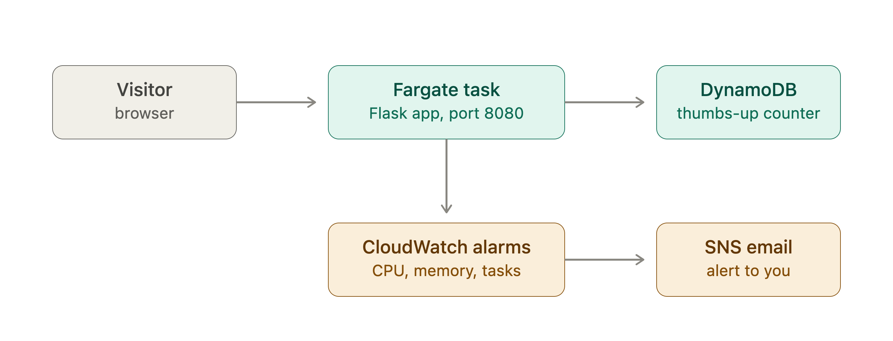
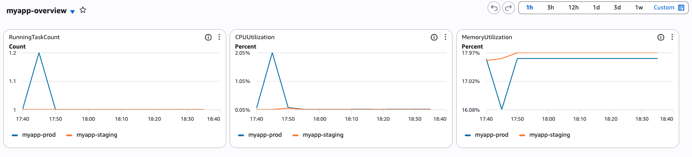

# Docker Project

[](https://github.com/liliyapetillo/docker-project/actions/workflows/deploy.yml)

A small Flask app, containerized and deployed to AWS ECS Fargate through a
gated CI/CD pipeline. The app itself (a personal portfolio page with a
DynamoDB-backed thumbs-up counter) is intentionally simple — the point of
this project was never the app. It was building real, hands-on muscle memory
for the full path a container takes from a laptop to a running, deployed
service: a correctly layered image, a pipeline that won't let untested code
through, a registry, a staged promotion with a real human approval gate
before production — the same shape as a real team's deployment process,
just scaled down to one developer and one small app.

The same image, promoted — staging on the left, production on the right:

 

*(Not kept running continuously, to control AWS cost — the screenshots above are it live in both environments.)*

## Architecture



A push to `main` runs `test` → `build-push` → `deploy-staging` →
`deploy-prod`, gated by a manual review in between. Nothing reaches ECR
without passing tests, and nothing reaches production without first
running in staging and being looked at by a person:



That review shows up wherever you'd expect it to — the Actions tab:



and your inbox:



Approving it deploys the exact image staging just ran — same digest, no
rebuild — and a moment later both services show it running:





The app reads and writes its thumbs-up counter in DynamoDB, and CloudWatch
alarms on CPU and memory feed an SNS topic that emails an alert — see
`scripts/RUNBOOK.md` for triage steps.



Visitors hit the task's public IP directly, with no load balancer (that
`http://54.196.164.111:8080` link above is exactly why — it changes on
every deploy).

Three separate IAM identities sit behind this, one per actor:

- **The deploy role**, used by GitHub Actions via OIDC.
- **`ecsTaskExecutionRole`**, used by ECS to pull the image and write logs.
- **`myapp-task-role`**, used by the Flask app, limited to `GetItem` and
  `UpdateItem` on the one table.

## Design decisions

- **Flask + Gunicorn, no reverse proxy or database in front** — deliberately
  minimal, so the project stayed about containerization and deployment
  mechanics, not framework choices.
- **ECS Fargate over EC2 or Kubernetes** — task definitions, services, and
  rolling deploys, without also having to manage servers or a control plane.
- **ECR and DynamoDB** — ECR pairs naturally with ECS and IAM with no extra
  auth plumbing; a single-item counter doesn't need a relational database,
  and it was a chance to scope IAM down to exactly two actions on one table.
- **OIDC, not static AWS keys, for GitHub Actions** —
  `aws-actions/configure-aws-credentials` + `role-to-assume` issues a
  short-lived, per-run token instead of a long-lived `AWS_ACCESS_KEY_ID`
  sitting in GitHub Secrets. Nothing to leak, nothing to rotate.
- **Least-privilege runtime identity, verified not assumed** —
  `myapp-task-role` (above) can `GetItem`/`UpdateItem` on one table and
  nothing else, confirmed directly: that identity can't list its own IAM
  policies or describe ECR repositories.
- **No secrets committed** — `.env`, `venv/`, and local AWS credentials are
  all gitignored; anything sensitive lives in GitHub Secrets.
- **Minimal public surface on the page itself** — only the contact info
  meant to be public; no phone number, no third-party trackers, images
  served from the app's own `static/` folder.
- **Fail-fast AWS calls** — a short connect/read timeout and limited
  retries on boto3, so a flaky AWS connection degrades the page instead of
  hanging a worker (see the gunicorn timeout incident below).

## What failed while building this, and how it was diagnosed

Most of the real learning happened here, not in the parts that worked on
the first try.

1. **Intermittent 10–30 second page hangs.**
   Gunicorn ran a single sync worker with its default 30-second timeout. An
   occasional slow connection to DynamoDB (via Docker Desktop's virtualized
   network) held that one worker long enough to trip gunicorn's own
   watchdog, which killed and rebooted the worker mid-request. Diagnosed by
   timing repeated `curl` requests and correlating the slow ones with
   `[CRITICAL] WORKER TIMEOUT` lines in the container logs. Fixed by giving
   boto3 an explicit short connect/read timeout with limited retries (fail
   in a few seconds instead of hanging near the 30-second ceiling), and by
   adding a second gunicorn worker so one slow request can't block every
   other request on the same process.

2. **`CannotPullContainerError: ... does not contain descriptor matching
   platform 'linux/amd64'` in ECS.**
   The image was built on an Apple Silicon Mac, which defaults to a
   `linux/arm64` image; Fargate defaults to `linux/amd64`. Diagnosed
   directly from the ECS task's stopped-reason message. Fixed with
   `docker build --platform linux/amd64`.

3. **`Input required and not supplied: image` in the ECS task-definition
   render step.** A job output containing the AWS account ID was being
   silently dropped by GitHub Actions
   (`Skip output 'image' since it may contain secret`, visible only in the
   raw job logs via `gh run view --log`), because `configure-aws-credentials`
   masks the account ID as a secret and GitHub won't propagate any output
   that appears to contain one. Fixed by not passing the image URI across
   jobs at all — each job that needs it logs into ECR itself and
   reconstructs the same deterministic URI locally.

4. **Outputs out of scope** `deploy-prod` referenced
   `needs.build-push.outputs.image`, but its own `needs:` list only included
   `deploy-staging` — GitHub Actions only exposes a job's outputs to jobs
   that list it *directly* in `needs:`, not transitively through a chain, so
   that reference could never have resolved to anything.

## What's next

This project deliberately stops short of a few things a real production
service would need:

- **A load balancer**, not a raw task IP — staging currently prints the
  running task's public IP because there's no ALB, so it changes on every
  deploy. An ALB would also mean TLS termination, a real domain, and
  health-check-based traffic draining during rolling deploys.
- **Private subnets** for the Fargate tasks, reached through that load
  balancer, instead of tasks holding public IPs directly, plus autoscaling
  instead of a fixed desired count.
- **A task-count alarm**, to match the CPU/memory ones that already exist
  (see `scripts/RUNBOOK.md`) — nothing currently alerts if the task count
  itself drops.
- **Blue/green deploys** (e.g. CodeDeploy) for instant rollback, instead of
  ECS's default rolling update.
- **Secrets Manager or SSM Parameter Store**, instead of plain environment
  variables in the task definition.
- **Real test coverage** beyond one health-check smoke test — mock
  DynamoDB (e.g. `moto`) and test the `/like` counter logic and its
  failure-handling paths.
- **Container hardening** — a non-root Dockerfile user, a base image pinned
  by digest, and image vulnerability scanning as a pipeline gate.
- **Pin GitHub Actions to commit SHAs**, not floating major-version tags,
  and add Dependabot to keep those and Python dependencies current
  automatically — closes a supply-chain gap where a compromised action
  release could run arbitrary code with the pipeline's AWS role.
- **Terraform** for the ECS cluster, services, and IAM roles instead of
  console setup, so infrastructure is reproducible and reviewable, not
  just the application code.
- **Run `scripts/health_check.py` on a schedule**, independent of deploys —
  right now it only confirms what `wait-for-service-stability` already
  checked seconds earlier. Not doing this yet since the environment isn't
  meant to run continuously, and a recurring check would just burn cost
  polling an app nobody's using.

## Setup

1. Build the image:
   ```bash
   docker build -t myapp:v1 .
   ```

2. Run it:
   ```bash
   docker run -p 8080:8080 myapp:v1
   ```

3. Access the app at `http://localhost:8080`

## Tests

```bash
pip install -r requirements-dev.txt
pytest
```

## Endpoints

- `GET /` - Portfolio page with a DynamoDB-backed thumbs-up counter
- `POST /like` - Increments the counter, returns the new count as JSON
- `GET /health` - Health check

## Scripts

- `scripts/health_check.py` - Compares the production ECS service's running
  task count against its desired count and exits non-zero on a mismatch, so
  it can plug into a CI health check rather than requiring a human to read
  its output. Reads `ECS_CLUSTER` and `ECS_SERVICE_PROD` from the
  environment (the same names already used as secrets in
  `.github/workflows/deploy.yml`). Runs today as a sanity-check step right
  after `deploy-prod`; it's written to also work as a standalone,
  deploy-independent check (see "What's next").
